# 直播间使用说明

By Ellu

## 1. 设置OBS

### 1.1. 安装OBS

- 下载地址：[https://obsproject.com/](https://obsproject.com/)

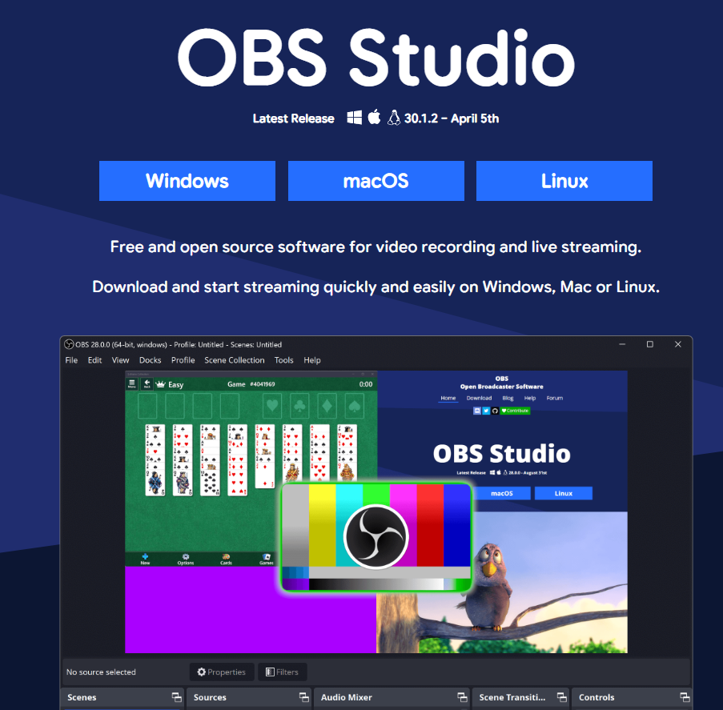

如图，点击`Windows`下载OBS，随后安装。

> 如果你用的Mac，请直接关闭文档，然后换人直播（

### 1.2. 下载整合包

打开从群里下载的整合包，其中应该包括下面这些文件

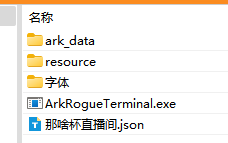

将他们解压到你找的到的地方，打开`字体`文件夹，全选，右键安装

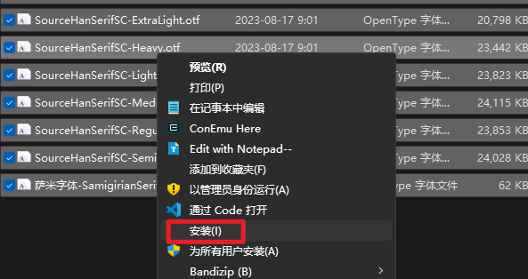

然后打开OBS

> 第一次启动OBS会跳出来个向导，你可以直接关掉

### 1.3. 导入配置

如图，点击`场景集合`，然后点击`导入`，点击`...`，添加解压后的文件`那啥杯直播间.json`，然后点击`导入`

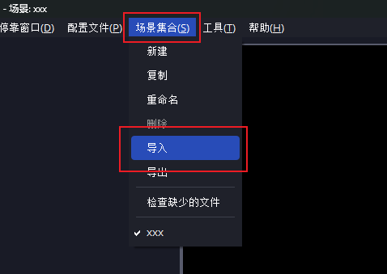
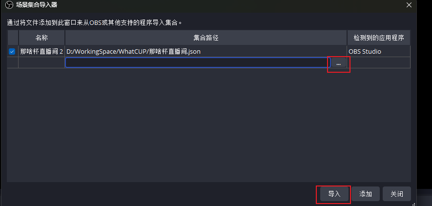

再次点击`场景集合`，选择`那啥杯直播间`进行切换

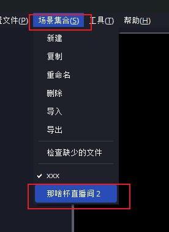

此时由于换了电脑，必然会弹出警告`缺少文件`

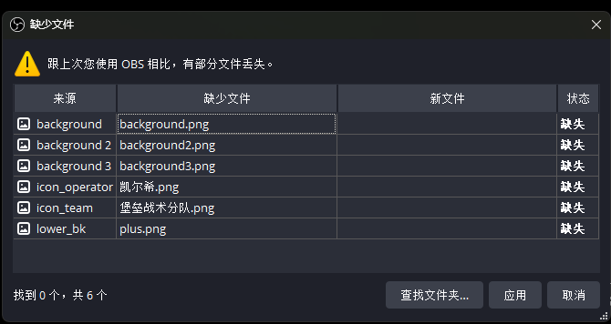

这时点击`查找文件夹`，找到解压后的`resource`文件夹进行自动导入

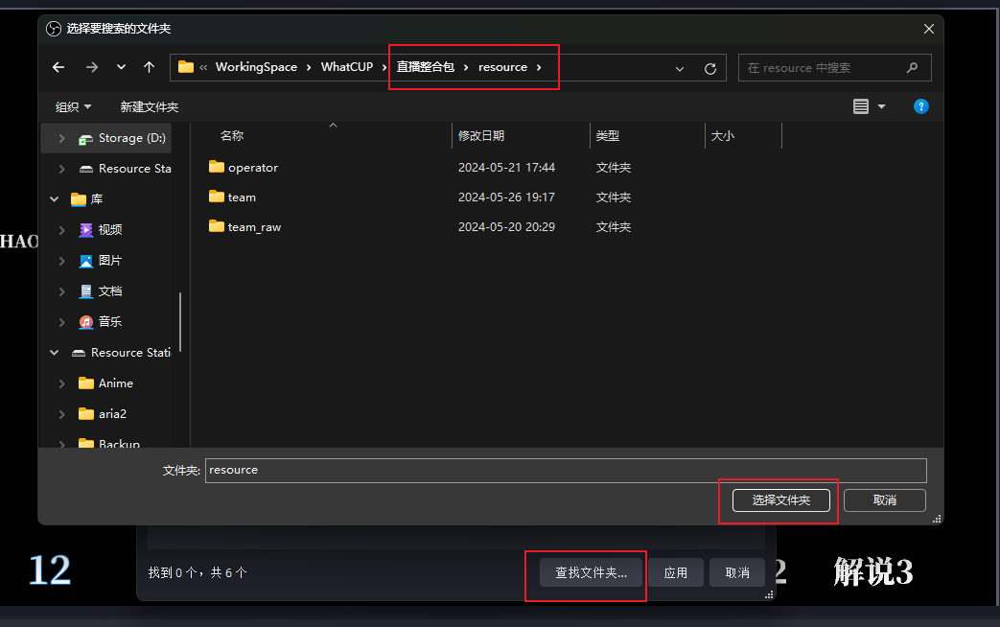

此时除了某些选项，大部分都应变为`已找到`，点击`应用`完成导入，直播间的设置就完成了

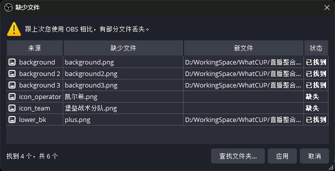

### 1.4. 设置直播间

**直播间除了比赛日`DAYx`和`当前解说`外，其他元素都由计分器控制，请不要手动更改**

- 设置比赛日：在`来源`中找到`text_day`，选中后在上方修改：

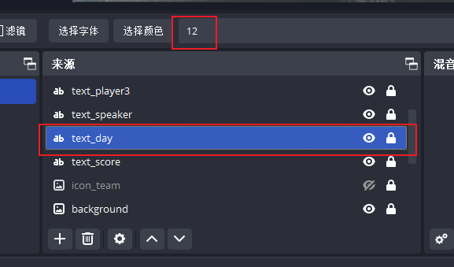

- 设置解说：在`来源`中找到`text_speaker`，选中后在上方修改：

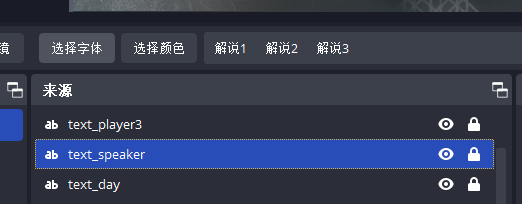

> 如果解说文字没对齐，点击`text_speaker`旁边的小锁解锁，然后在上方的预览窗口中拖动文字到合适位置，再次点击小锁锁定

## 2. 计分器连接和使用

### 2.1. 连接计分器

双击打开`ArkRogueTerminal.exe`，等待加载后应如下

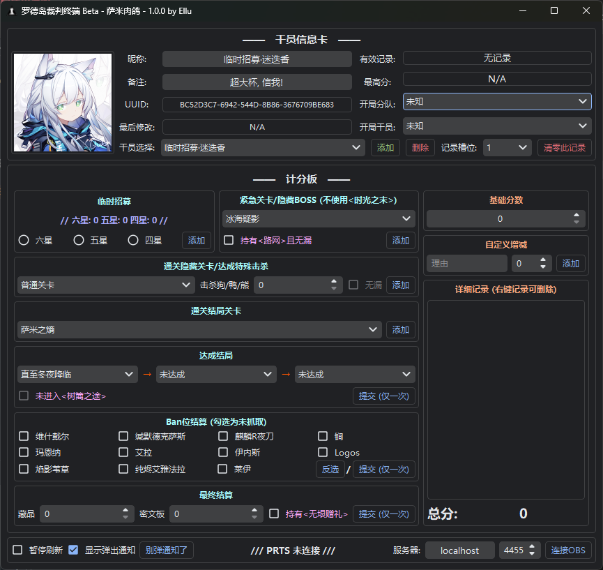

转到OBS，点击`工具`，选择`WebSocket服务器设置`

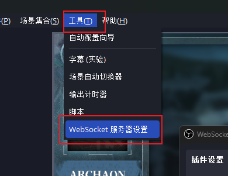

如图调整选项，点击`应用`，然后点击`确定`

转到计分器，点击右下角的`连接OBS`，等待后应显示`PRTS已连接`

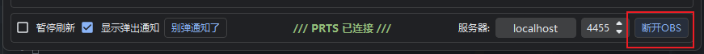

### 2.2. 计分器使用

计分器分为上中下三部分，分别对应`选手存档管理`、`计分`、`OBS控制`

在存档管理部分，点击添加可新增选手，**新增的选手会显示`无头像`**，这时进入`ark_data/avatar`文件夹，将选手头像放在这里，名字改为选手的昵称，返回软件重新切换到选手即可正确识别头像

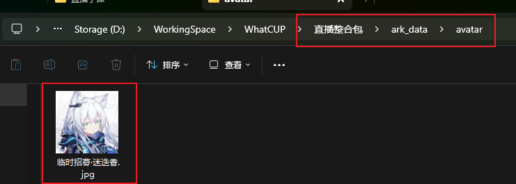

> 头像分辨率不限，但必须是1:1的正方形

每个选手有16个记录槽位，对应不同的存档，切换即可查看和修改对应的记录，如果一个选手有重开之类的操作，记得切换别的槽位，不要直接覆盖。

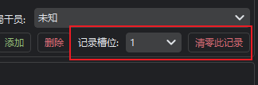

在存档管理和计分部分，进行任意操作时，如果已经连接了OBS，所有操作都会同步到OBS（**包括修改选手、开局干员和分队、修改基础分数等**），如果想在后台调整数据而不影响直播，可以勾选左下角的`暂停刷新`，此时所有操作都不会同步到OBS，直到取消勾选（这时会立即同步所有数据）

在计分部分，所有的更改操作都会在直播间生成一个浮窗，如果想暂时隐藏这个浮窗，可以取消勾选`显示弹出通知`，如果短时间进行大量计分操作，可能会导致弹窗积压（弹窗是一个个排队显示的），这时可以点击`别弹通知了`，这样所有未显示的弹窗都会被取消（也会导致分数不同步，再任意修改一次分数即可）

## 3. B站开播说明

> 这里只是简单的说明，具体的开播流程和参数在群里讨论

### 3.1. 设置直播间

首先设置OBS，找到`来源`中的`窗口采集`，如图

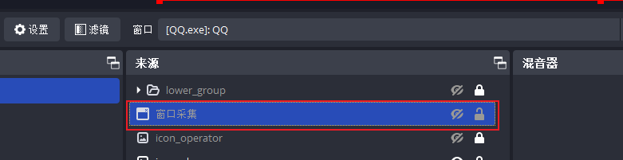

点击上面的`设置`，按下面配置，重点是修改采集窗口和匹配模式，然后点击`确定`

> 需要注意，如果使用浏览器采集别的直播，最好使用B站的`窗口全屏`，当全屏应用遮盖时浏览器为了节省资源会让视频黑屏

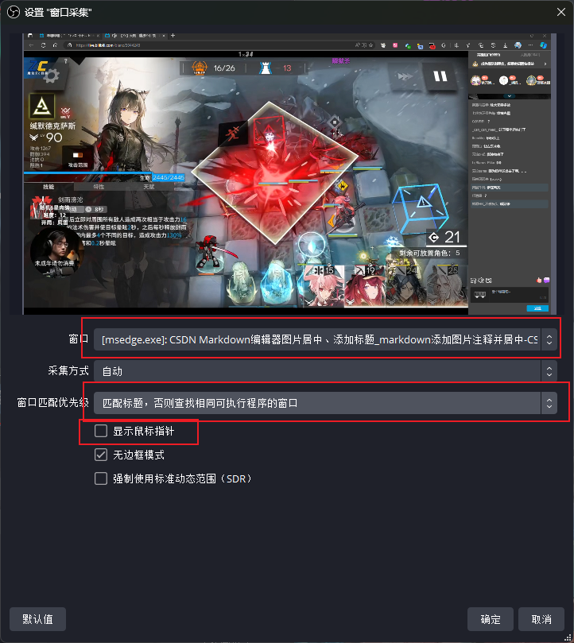

然后点击`窗口采集`右边的小眼睛，开启来源

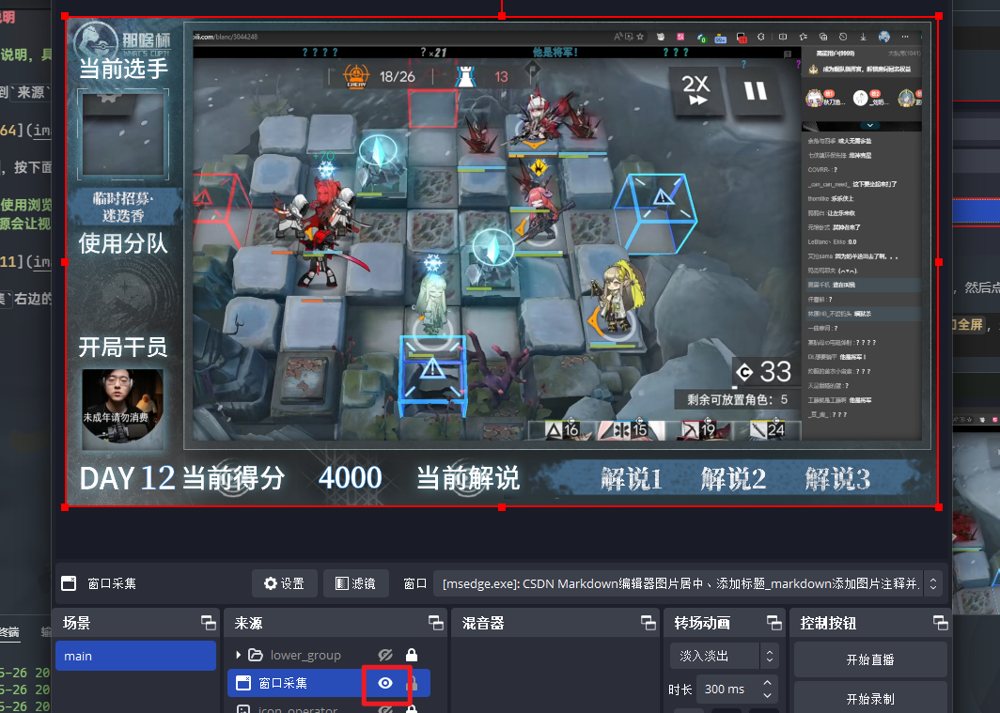

此时直播间尺寸大概不对的，拖动来源的边缘调整大小，使其匹配右上角预留的位置的同时，隐藏不需要的元素

> 按住`Shift`的同时拖动来保持比例，如果比例已经不对了，按`Ctrl+R`重置比例

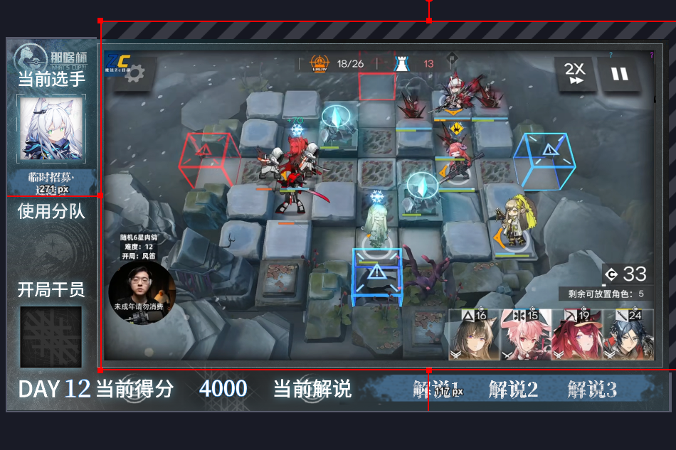

在左下角的`场景`选择`idle`，切换到空闲场景

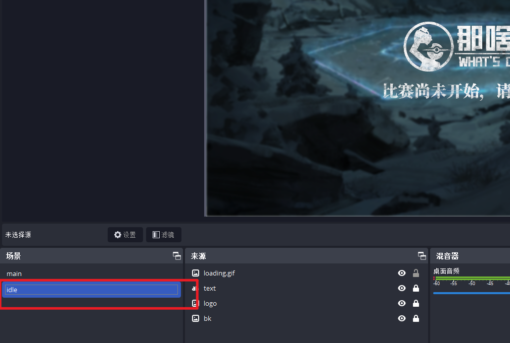

### 3.2. 开始直播

打开[个人直播设置](https://link.bilibili.com/p/center/index#/my-room/start-live)，如图

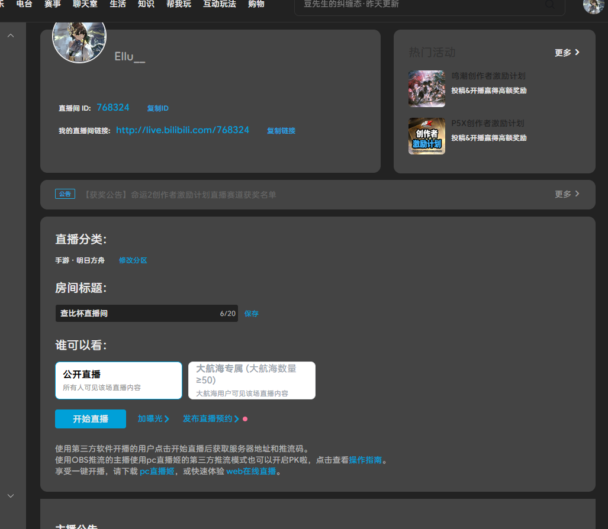

**按要求修改直播间标题、封面、标签等**，然后点击`开始直播`，会获得直播地址

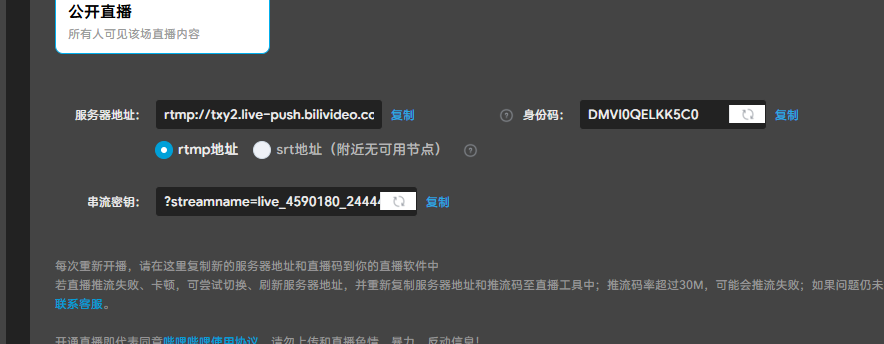

点击OBS右下角的`设置`，按照下图逐级设置

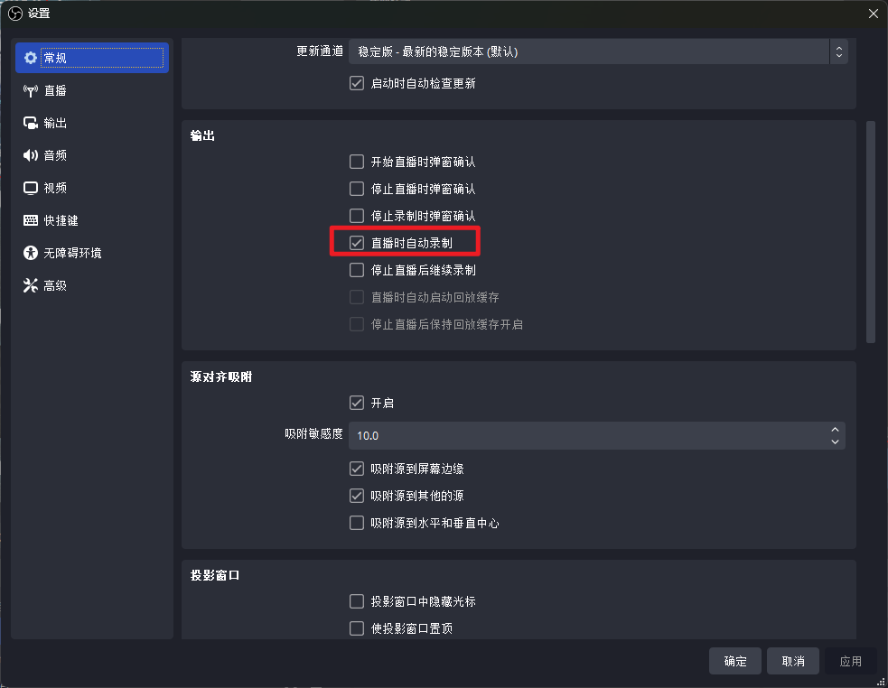

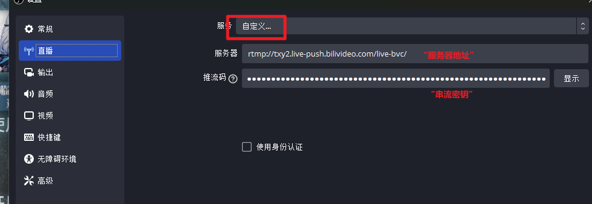

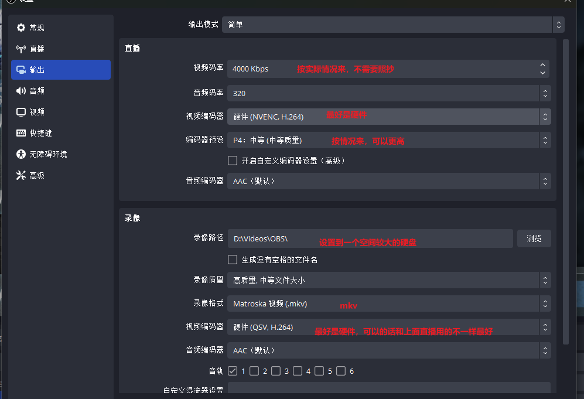

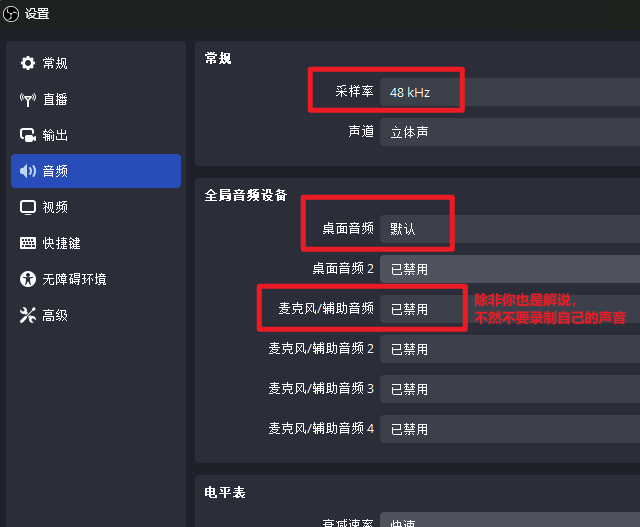

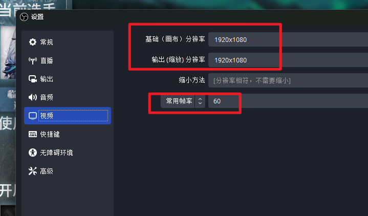

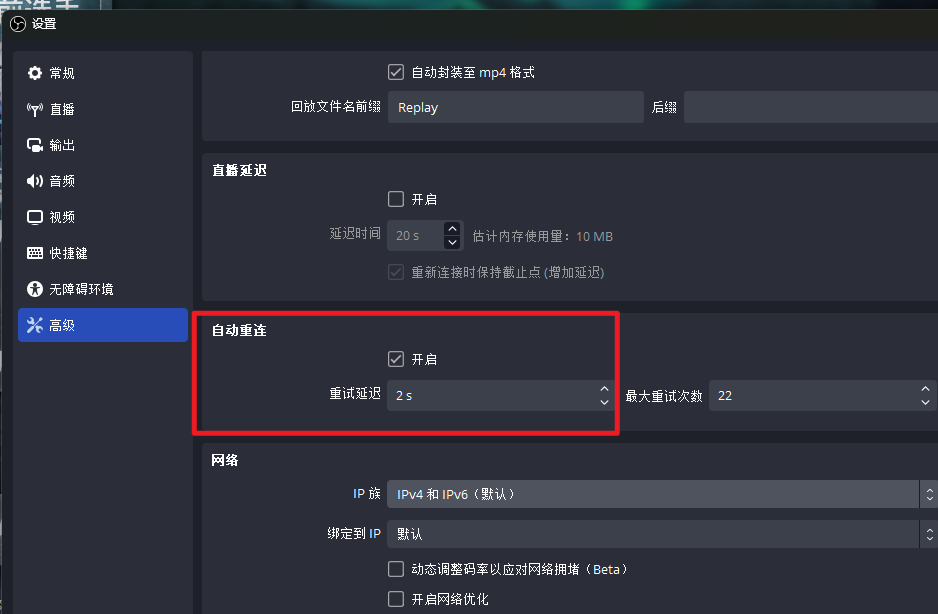

设置完后应用并确认，此时点击右下角的`开始直播`，直播间推流就启动了
