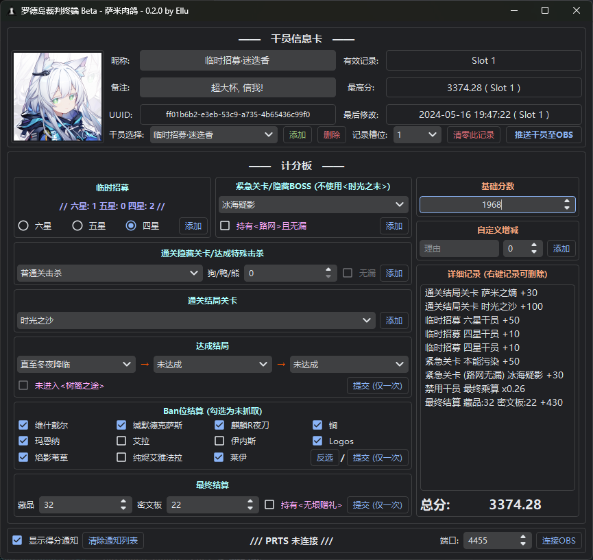
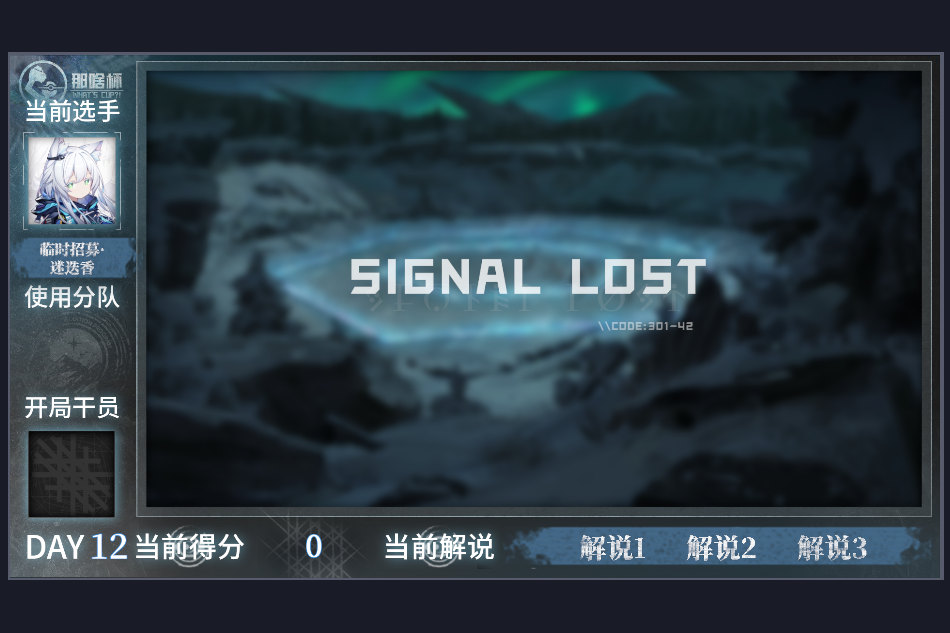

# Arknights Rogue-like Competition Terminal

明日方舟肉鸽比赛计分终端，始于华科`那啥杯`（又名`查比杯`）

> [!NOTE]
> 当前版本：**萨米**

## 界面

## 功能

- [x] 总分计算
- [x] 玩家记录数据库
- [x] 多记录槽位
- [x] 编译到X86可执行文件
- [x] OBS直播间模板
- [x] OBS玩家昵称、头像推送
- [x] OBS总分实时同步
- [x] OBS得分浮窗通知效果
- [x] OBS界面管理（开局、解说、页面切换）

## 使用说明

见 [instruction.md](./instruction.md)
